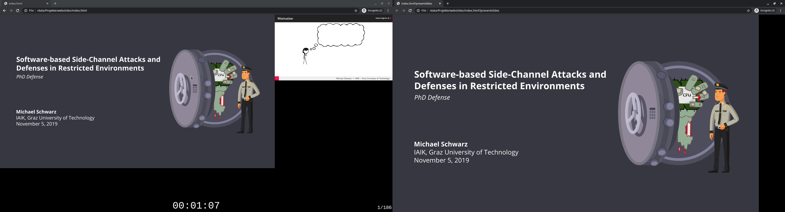

# PDF Web Slides 

This tool allows converting PDF presentation slides to a self-contained HTML5 file. The resulting HTML5 file also contains a presentation mode which mimics the functionality of [pdfpc](https://github.com/pdfpc/pdfpc). 

*Presentation mode (left) with a preview of the next slides and a timer which either counts up or down, and the presentation view (right)*

# Usage

The first step is to convert a PDF to an HTML5 file. This is simply done by running

    pdf-webslides <pdf file>
    
The output is an `index.html` file and a corresponding `slides.js` in the current directory. Note that it is also possible to generate a standalone `index.html` using the `-s` option. If the HTML file is opened, it shows the slides in the same way as the original PDF. Slides can simply be navigated using left/right arrow keys, page-up/page-down keys, as well as by swiping over the slides. 

## Presenter Mode

Presenter mode is a mode where the audience sees the slides, while the presenter sees the current and next slide, a timer, and speaker notes. 
The presenter mode of PDF Web Slides mimics the presenter mode of [pdfpc](https://github.com/pdfpc/pdfpc). 

### Starting Presenter Mode

To start the slides in presenter mode, there are two possibilities. 
First, the presenter mode can be set as the default mode at conversion time by providing the `-p` option, i.e., 

    pdf-webslides -p <pdf file>
    
However, even if the presenter mode was not set as the default mode, it can be activated by pressing the `P` key. 
Alternatively, appending `?presenter=1` to the URL opens the slides in presenter mode. 

### Keyboard Shortcuts

| Key | Description |
|--|--|
| Right / Page Down / Swipe Right to Left |  Go to next slide                                  |
| Left / Page Up / Swipe Left to Right | Go to previous slide                            |
| Home | Go to first slide |
| End | Go to last slide |
| g   | Input slide number to go to |
| +   | Increase note size |
| -   | Decrease note size |
| b   | Turn on/off presentation view, i.e., display an entirely black screen |
| f   | Freeze/unfreeze presentation view. Any change in the presenter mode is not shown on the presentation view |
| r   | Reset timer |
| p   | Display/hide a pointer (i.e., a virtual laser pointer) |

### Notes

The tool supports the same type of notes as pdfpc. Hence, they can also be directly embedded in LaTeX beamer.
With the following macro

    \newcommand<>{\pnote}[1]{\only#2{\tikz[remember picture,overlay]{\node{\pdfmargincomment[opacity=0]{#1}}}}}

notes can be added to a certain animation-step of a slide by adding something like 

    \pnote<1>{Speaker note for step 1 of the current slide.}
    
If there are notes in the PDF, they are shown below the preview of the next slide. 

### Videos

PDF Web Slides has a rudimentary support for videos. 
Videos can be used in the same way as with pdfpc, e.g., using [pdfpc-commands.sty](https://github.com/dcherian/tools/blob/master/latex/pdfpc-commands.sty). 
Note that videos are not embedded into the HTML file, they have to be in the same folder. 

# Installation

## Pre-built Binaries (Linux and Windows)

The folder `dist` contains pre-built versions of the tool. 
For Linux, it contains a Debian package, for Windows a ZIP file containing the binary and the required DLLs. 

## PPA (Linux)

First, add the public key of the PPA and the PPA URL to the package manager, and update the package manager

    curl -s "https://misc0110.github.io/ppa/KEY.gpg" | sudo apt-key add -
    sudo curl -s -o /etc/apt/sources.list.d/misc0110.list "https://misc0110.github.io/ppa/file.list"
    sudo apt update

Then, simply install the tool

    sudo apt install pdf-webslides

## From Source

### Linux

The tool depends on Poppler and Cairo for converting the PDF to SVGs. 
On Ubuntu, the dependencies can be installed through 

    apt install libcairo2-dev libpoppler-glib-dev
    
Then, the tool can be built by running

    make
    
and 

    make install
    
to install the tool as `pdf-webslides`. 

### Windows

On Windows, the tool can be built using MSYS2. 
First, install the required libraries and tools

    pacman -S gcc make mingw64/mingw-w64-x86_64-cairo mingw64/mingw-w64-x86_64-pkg-config mingw64/mingw-w64-x86_64-poppler 
   
Then, the tool can be built by running

    make -f Makefile.win
	

